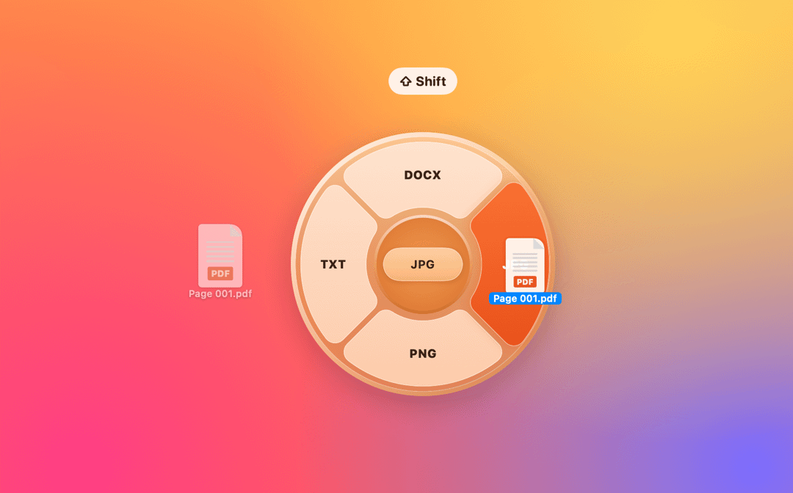
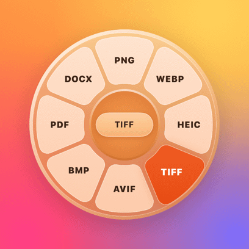
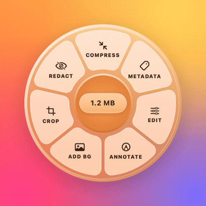
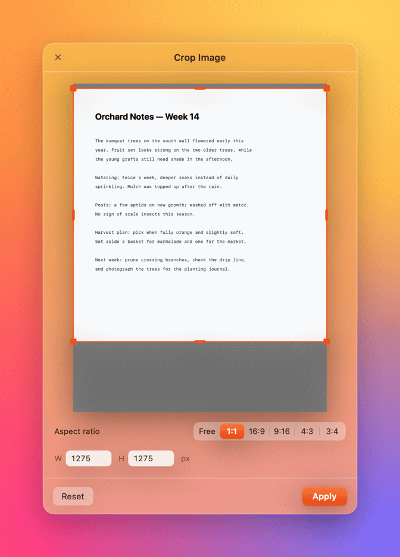
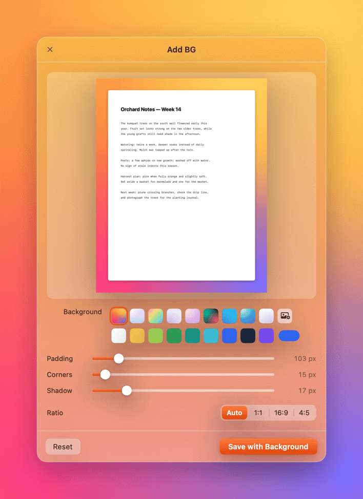
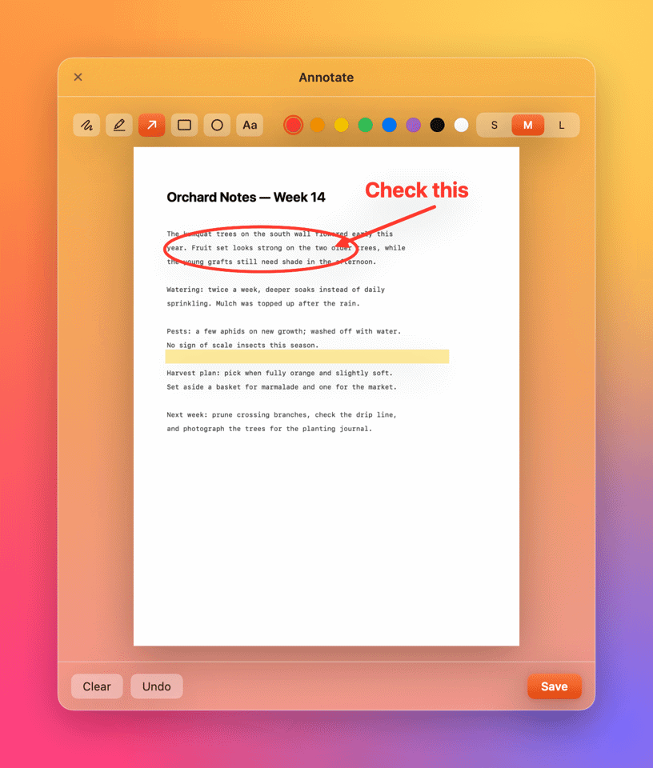
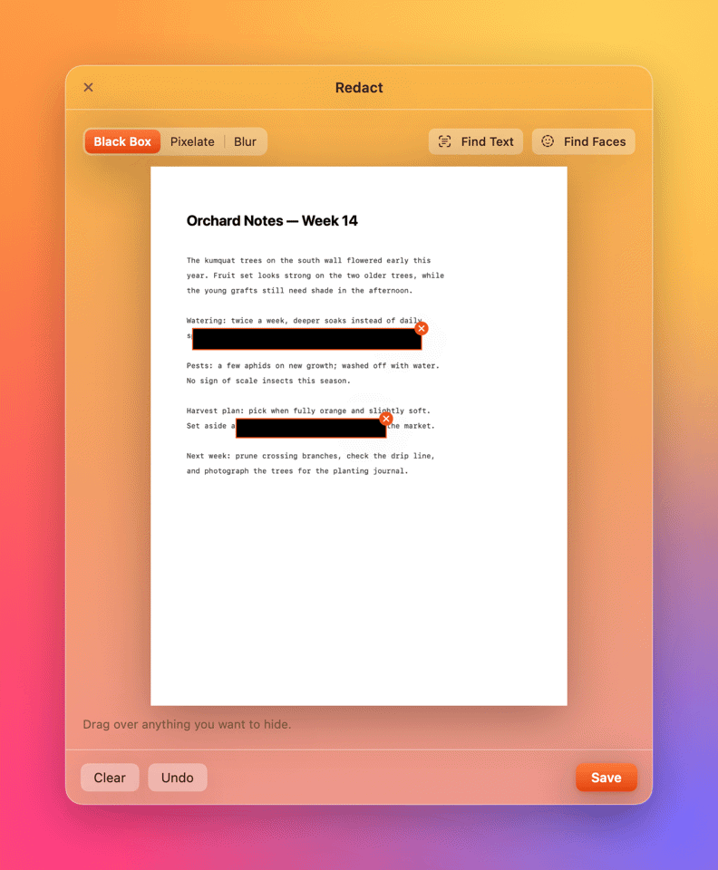

<p align="center"></p>

<h1 align="center">Kumquat 金桔</h1>

<p align="center">
拖动文件时按住 <b>⇧ Shift</b>，就地转换格式——不用打开任何窗口。<br>
Hold <b>⇧ Shift</b> while dragging a file to convert it right where it is.
</p>

<p align="center"></p>

<p align="center"><a href="#中文">中文</a> · <a href="#english">English</a></p>

---

## 中文

Kumquat 是一个 macOS 菜单栏小工具。在访达（或桌面、任意应用）里拖动文件时按住 **⇧ Shift**，指针周围会弹出一个**格式轮盘**；把文件拖到想要的格式上松手，转换好的副本就保存在原文件旁边。按住 **⌥ Option + ⇧ Shift** 则弹出**工具轮盘**：压缩、清除元数据、调色、标注、加背景、裁剪、打码……所有处理都在你的 Mac 本地完成，不上传任何文件。

### 怎么用

| 操作 | 效果 |
| --- | --- |
| 拖动文件 + 按住 **⇧ Shift** | 弹出格式轮盘，拖到格式上松手即可转换 |
| 拖动文件 + 按住 **⌥ Option + ⇧ Shift** | 弹出工具轮盘（PDF、图片、视频、音频各有不同工具） |
| 拖回轮盘中心松手，或把指针拖远 | 取消，文件照常拖放 |
| 点击完成提示 | 在访达中显示结果 |

<p align="center">


</p>

### 支持的格式与工具

| 拖入的文件 | ⇧ 格式轮盘 | ⌥⇧ 工具轮盘 |
| --- | --- | --- |
| **图片** JPG · PNG · HEIC · WebP · AVIF · TIFF · BMP · GIF · RAW … | JPG · PNG · WEBP · HEIC · TIFF · AVIF · BMP · PDF · DOCX（GIF 还可转 MP4） | 压缩 · 元数据 · 编辑 · 标注 · 加背景 · 裁剪 · 打码 |
| **PDF** | DOCX · JPG · PNG · TXT | 压缩 · 旋转 · 拆分 · 水印 · 元数据（多个 PDF：合并） |
| **文档** DOCX · DOC · RTF · ODT · HTML · TXT · Markdown | PDF · DOCX · RTF · TXT · HTML · ODT · MD | — |
| **视频** MP4 · MOV · M4V（装了 ffmpeg 还支持 MKV · WebM · AVI …） | MP4 · MOV · GIF · M4A（+ WEBM · MP3） | 压缩 · 剪辑 · 静音 · 旋转 · 截帧 |
| **音频** MP3 · M4A · WAV · AIFF · FLAC · CAF | M4A · WAV · FLAC · AIFF（+ MP3） | 剪辑 · 压缩 |

- 一次拖多个文件时，轮盘只显示它们都支持的格式；多张图片还能「合并」成一个 PDF。
- 图片转 DOCX 会嵌入原图，并附上 OCR 识别出的文字（支持中英文）；扫描版 PDF 转 TXT / DOCX 时自动 OCR。
- PDF 转图片默认 300 dpi；多页 PDF 会生成一个「文件名 Pages」文件夹。
- 压缩：JPG/HEIC 重新编码并去掉元数据，PNG 做调色板量化（类似 pngquant / TinyPNG），视频转为 HEVC，音频转为 128 kbps AAC。

### 工具窗口

<p align="center">


</p>
<p align="center">


</p>

裁剪（自由 / 1:1 / 16:9 / 9:16 / 4:3 / 3:4，可直接输入像素）、加背景（渐变 / 纯色 / 自选图片，边距、圆角、阴影、比例）、编辑（曝光、对比度、饱和度、色温、高光阴影、锐化、暗角、旋转翻转，按住预览可对比原图）、标注（画笔、荧光笔、箭头、矩形、椭圆、文字）、打码（黑框 / 马赛克 / 模糊，可一键识别文字和人脸）、元数据（查看相机信息和定位，一键去除位置或全部元数据）、PDF 水印、音视频剪辑。

### 安装

1. 从 [Releases](https://github.com/kelvin715/Kumquat/releases) 下载 `Kumquat.zip`，解压后拖进「应用程序」。
2. 首次打开：这是开源的自签名应用（未经 Apple 公证），请在「应用程序」里**右键 → 打开**，或在终端执行
   ```bash
   xattr -dr com.apple.quarantine /Applications/Kumquat.app
   ```
3. Kumquat 常驻菜单栏（没有 Dock 图标）。第一次把结果保存到「桌面 / 文稿 / 下载」时，macOS 会询问文件夹访问权限，点「允许」即可。**不需要**辅助功能、录屏等特殊权限。

从源码构建（需要 macOS 14+、Xcode 15+ / Swift 5.10+）：

```bash
git clone https://github.com/kelvin715/Kumquat.git
cd Kumquat
make install
```

### 可选：Homebrew 工具

```bash
brew install ffmpeg webp
```

装好后 Kumquat 会自动发现它们：`ffmpeg` 带来 MP3 / WebM 输出以及 MKV、WebM、AVI、OGG 等输入；装了 `cwebp` 时 WebP 会交给它编码。不装也完全能用——Kumquat 自带纯 Swift 实现的 WebP 编码器（有损 VP8 + 无损 VP8L），在 900 万像素照片上与 cwebp 的体积和画质几乎一致。

### 命令行

同一个程序也可以在终端里用：

```bash
alias kumquat=/Applications/Kumquat.app/Contents/MacOS/Kumquat
kumquat convert ~/Desktop/*.heic --to jpg
kumquat convert report.pdf --to docx
kumquat tool compress screen-recording.mov
kumquat actions photo.png        # 看看轮盘会显示什么
```

### 原理

- **无需特殊权限**：用全局鼠标事件监听 + 拖拽剪贴板（`NSPasteboard(name: .drag)`）的变化计数发现文件拖拽，拖拽期间以 60 Hz 轮询修饰键；如果系统不允许后台应用读取拖拽内容，轮盘会先出现，再从自己的拖放回调里拿到文件。
- **轮盘本身就是拖放目标**：按下 Shift 时，在指针下方弹出一个不抢焦点的透明面板，按扇区几何做命中测试（扇区之间的缝隙也算最近的扇区）。
- **全部本地处理**：ImageIO、PDFKit、AVFoundation、Vision（OCR）、TextKit，以及内置的 WebP 编码器——有损 VP8（16×16 帧内预测、DCT + WHT、上下文自适应的布尔熵编码与概率更新）和无损 VP8L（预测、减绿、调色板变换，LZ77 + 颜色缓存）——还有 DOCX 写入器和 PNG 调色板量化器。

### 开发

```bash
swift test        # 核心库单元测试（WebP 编码器、几何、命名、DOCX、量化、元数据、PDF 渲染…）
make self-test    # 用模拟的拖拽会话驱动真实的轮盘面板
make previews     # 离屏渲染 README 里的截图
make app          # 构建 build/Kumquat.app（Apple 芯片 + Intel 通用）
```

```
Sources/KumquatCore   转换引擎（无界面，可单独复用）
  Model/              文件分类、轮盘动作目录、轮盘几何
  Image/ WebP/ PDF/ Docs/ Media/ OCR/
Sources/Kumquat       菜单栏应用
  Drag/               拖拽监听、轮盘面板与拖放
  UI/ Tools/          轮盘、提示、设置、各工具窗口
  CLI/                命令行、截图渲染、自测
```

### 声明

「拖拽时按 Shift 弹出格式轮盘」的交互灵感来自 Mac 应用 Tangerine。Kumquat 是独立的开源实现，与其没有任何关联，也没有使用其任何代码、图标或素材。

---

## English

Kumquat is a small macOS menu bar app. While dragging a file — in Finder, on the Desktop or from any app — hold **⇧ Shift** and a **format wheel** appears around the pointer. Drop the file on a format and the converted copy is saved next to the original. Hold **⌥ Option + ⇧ Shift** for the **tool wheel**: compress, strip metadata, edit, annotate, add a background, crop, redact and more. Everything runs locally on your Mac.

### Using it

| Do this | What happens |
| --- | --- |
| Drag a file, hold **⇧ Shift** | The format wheel opens; drop on a format to convert |
| Drag a file, hold **⌥ Option + ⇧ Shift** | The tool wheel opens (different tools for images, PDFs, video, audio) |
| Drop on the centre, or move far away | Cancels; the drag carries on as normal |
| Click the notification | Shows the result in Finder |

### Formats and tools

| You drag | ⇧ Formats | ⌥⇧ Tools |
| --- | --- | --- |
| **Images** JPG · PNG · HEIC · WebP · AVIF · TIFF · BMP · GIF · RAW … | JPG · PNG · WEBP · HEIC · TIFF · AVIF · BMP · PDF · DOCX (GIF also → MP4) | Compress · Metadata · Edit · Annotate · Add BG · Crop · Redact |
| **PDF** | DOCX · JPG · PNG · TXT | Compress · Rotate · Split · Watermark · Metadata (several PDFs: Merge) |
| **Documents** DOCX · DOC · RTF · ODT · HTML · TXT · Markdown | PDF · DOCX · RTF · TXT · HTML · ODT · MD | — |
| **Video** MP4 · MOV · M4V (with ffmpeg: MKV · WebM · AVI …) | MP4 · MOV · GIF · M4A (+ WEBM · MP3) | Compress · Trim · Mute · Rotate · Snapshot |
| **Audio** MP3 · M4A · WAV · AIFF · FLAC · CAF | M4A · WAV · FLAC · AIFF (+ MP3) | Trim · Compress |

- With several files selected, the wheel offers the formats they have in common; several images can be merged into one PDF.
- Image → DOCX embeds the picture plus the text recognized in it (OCR, Chinese and English). Scanned PDFs are OCR'd when converted to TXT or DOCX.
- PDF → image renders at 300 dpi; multi-page PDFs produce a "Name Pages" folder.
- Compress re-encodes JPG/HEIC without metadata, palette-quantizes PNG (like pngquant/TinyPNG), re-encodes video as HEVC and audio as 128 kbps AAC.

### Install

1. Download `Kumquat.zip` from [Releases](https://github.com/kelvin715/Kumquat/releases), unzip it and move it to Applications.
2. The app is open source and signed ad hoc (not notarized). The first time, **right-click → Open** it, or run `xattr -dr com.apple.quarantine /Applications/Kumquat.app`.
3. Kumquat lives in the menu bar. The first time it saves into Desktop, Documents or Downloads, macOS asks for folder access — click Allow. No Accessibility or Screen Recording permission is needed.

Build from source (macOS 14+, Xcode 15+ / Swift 5.10+): `git clone https://github.com/kelvin715/Kumquat.git && cd Kumquat && make install`.

Optional: `brew install ffmpeg webp` adds MP3/WebM output and MKV/WebM/AVI/OGG input, and hands WebP encoding to `cwebp`. Without them Kumquat uses its own WebP encoders (lossy VP8 and lossless VP8L), which on a 9-megapixel photo match cwebp's size and quality within a fraction of a dB.

The app binary doubles as a command-line tool: `Kumquat.app/Contents/MacOS/Kumquat convert photo.heic --to jpg`, `… tool compress clip.mov`, `… actions file.pdf`.

### How it works

- **No special permissions.** Global mouse monitors plus the drag pasteboard's change count reveal file drags; modifier keys are polled at 60 Hz during a drag. If the system won't let a background app read the drag, the wheel opens anyway and learns the files from its own drop callback.
- **The wheel is the drop target.** Pressing Shift shows a non-activating, transparent panel under the pointer; hit-testing uses the wheel geometry, so the gaps between segments count as the nearest segment.
- **Local processing** with ImageIO, PDFKit, AVFoundation, Vision and TextKit, plus built-in WebP encoders — lossy VP8 (16×16 intra prediction, DCT + WHT, context-adaptive boolean coding with probability updates) and lossless VP8L — a DOCX writer and a PNG palette quantizer.

Run `swift test`, `make self-test` (drives the real wheel with a simulated drag session) and `make previews` (renders the screenshots above) while developing.

### Credits

The "hold Shift while dragging" format wheel is inspired by the Mac app Tangerine. Kumquat is an independent open-source implementation, not affiliated with it, and uses none of its code, icons or assets.

## License

[MIT](LICENSE)
